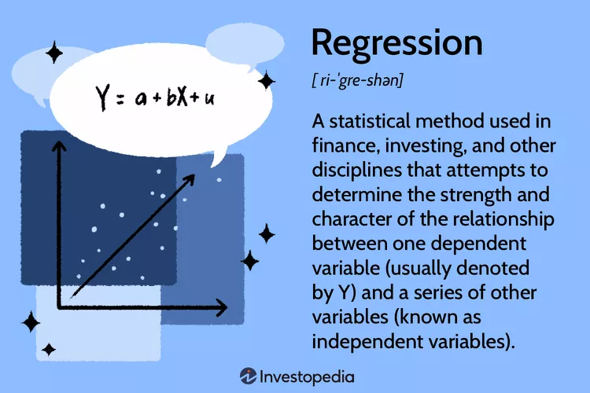

# Deep Learning models

## RNN

    

    

---
## LSTM

    

---
## CNN

    

---
## GAN

    

---
## VAE

    

    

---
---
# Machine Learning

## Regression

    

### Linear Regression

    

### Logistic Regression

Logistic regression is a predictive analysis technique used when the dependent variable is binary, like presence/absent, yes/no. Consider the simplest case with two predictors, $X_1$ and $X_2$, and a binary variable $Y$. Let p denote the probability that $Y = 1 (p = P(Y = 1))$. It is assumed a linear relationship between the predictor variables and the log-odds (also called logit) of the event that $Y = 1$. In statistics, the logit function is the logarithm of the odds (a measure of the likelihood of a particular outcome) of the result $\frac{p}{1-p}$. This relationship can be written as:

    

    

---
## Time Series Prediction

    

---
## Classification

    

### Support Vector Machine (SVM) 

    

### Instance-based learning

    

### Decisison Tree

    

    

### Ensemble Learning
**Random Forest** 
Random Forests (RFs) is a bagging ensemble learning method that generates several decision trees during the training phase and returns as result the mean prediction of the individual trees. Extremely Randomized Trees, also referred as extra trees, is another ensemble method that changes the tree generation by introducing more variation, such as tree depth.
Random forest models are often more accurate than single-tree models because they’re less prone to overfitting and they’re more robust against new types of data.

**Boosting** 

In boosting weak learners are sequentially combined in an adaptive way, i. e. each model gives more importance to the misclassified examples by assigning lower weights to correctly classified examples and higher weights to examples difficult to classify. **AdaBoost** [33] is the most known boosting method.

**Gradient Boosting (GB)** is an ensemble method that builds weak learners by optimizing a suitable cost function.**XGBoost** is an efficient implementation of Gradient Boosting which obtains more accurate predictions.
Stacking ensemble is a variation of ensemble learning whose main characteristic is the combination of different types of weak learners.

### Difference between Decision Tree and Random Forest

    

# Evaluation metrics

    

    

